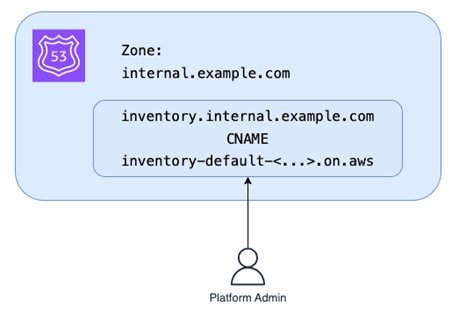
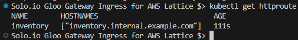
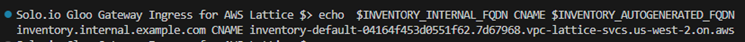
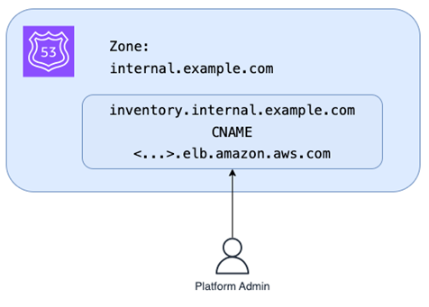

# DNS Resolution Setup for VPC Lattice Integration

This directory contains all the necessary assets and instructions to configure DNS routing for services behind Amazon VPC Lattice,
as demonstrated in the accompanying [Blog](TODO:URLhttps://www.solo.io).

---

## 🧭 Overview

In this scenario, Gloo Gateway acts as the ingress for a Kubernetes-based application that communicates with other services via Amazon VPC Lattice.
To simplify access and improve observability, this guide demonstrates how to replaces auto-generated FQDNs with user-friendly internal and external DNS records.

---

## 📌 Internal (Private) FQDN

Amazon VPC Lattice generates private service names. To map these to user-friendly internal hostnames:

1. **Define the internal FQDN**:

```bash
INVENTORY_INTERNAL_FQDN=inventory.internal.example.com
```

2. **Patch the HTTPRoute manifest**:

```bash
YAML_URL="https://raw.githubusercontent.com/aws/aws-application-networking-k8s/main/files/examples/inventory-route.yaml"
OUTPUT_FILE="inventory-route.yaml"
curl -o $OUTPUT_FILE $YAML_URL
yq eval '.spec.hostnames += ["'"$INVENTORY_INTERNAL_FQDN"'"]' -i $OUTPUT_FILE
kubectl apply -f $OUTPUT_FILE
```

Alternatively, apply the following YAML without using yq:
```bash
kubectl apply -f - << EOF
apiVersion: gateway.networking.k8s.io/v1beta1
kind: HTTPRoute
metadata:
  name: inventory1
spec:
  parentRefs:
    - name: my-hotel
      sectionName: http
  rules:
    - backendRefs:
        - name: inventory-ver1
          kind: Service
          port: 80
          weight: 10
  hostnames:
    - $INVENTORY_INTERNAL_FQDN
EOF
```
Confirm that the operation is successful by running “kubectl get httproute”:



Note: If the command fails, check the HTTP Route status with “kubectl get httproute -o yaml.” Often, the controller just needs more time to finish creating the Amazon VPC Lattice object.

3. **Retrieve the generated FQDN**:

Now everything is ready to associate VPC Lattice auto generated FQDN to the internal FQDN that is stored in INVENTORY_INTERNAL_FQDN environmental variable. The below commands will obtain auto-generated FQDN and prints out all necessary values for the internal zone DNS update:

```bash
INVENTORY_AUTOGENERATED_FQDN=$(kubectl get httproute inventory -o json | jq -r '.metadata.annotations."application-networking.k8s.aws/lattice-assigned-domain-name"')
echo  $INVENTORY_INTERNAL_FQDN CNAME $INVENTORY_AUTOGENERATED_FQDN
```



4. **Update Route 53 DNS (if using AWS-hosted internal DNS)**:

```bash
DOMAIN=$(echo $INVENTORY_INTERNAL_FQDN | sed 's/^[^.]*\.//')
HOSTED_ZONE_ID=$(aws route53 list-hosted-zones-by-name --dns-name $DOMAIN --query "HostedZones[0].Id" --output text)
TTL=300

aws route53 change-resource-record-sets \
    --hosted-zone-id $HOSTED_ZONE_ID \
    --change-batch '{
        "Comment": "Creating CNAME record for '"$INVENTORY_INTERNAL_FQDN"'",
        "Changes": [{
            "Action": "UPSERT",
            "ResourceRecordSet": {
                "Name": "'"$INVENTORY_INTERNAL_FQDN"'",
                "Type": "CNAME",
                "TTL": '"$TTL"',
                "ResourceRecords": [{"Value": "'"$INVENTORY_AUTOGENERATED_FQDN"'"}]
            }
        }]
    }'
```

---

## 🌐 External (Public) FQDN

To expose the endpoint externally, create a CNAME to the AWS Load Balancer behind Gloo Gateway:

1. **Obtain the public FQDN**:

```bash
INVENTORY_PUBLIC_FQDN=$(echo $INVENTORY_INTERNAL_FQDN | sed 's/\.internal//')
```

2. **Get AWS Load Balancer address from Gloo Gateway**:

```bash
GLOO_GATEWAY=$(kubectl -n gloo-system get svc gateway-proxy -o jsonpath='{.status.loadBalancer.ingress[0].*}')
echo  $INVENTORY_PUBLIC_FQDN CNAME $GLOO_GATEWAY
```
the output should display AWS loadBalancer URL:

3. **Create public Route 53 record**:

```bash
PUBLIC_DOMAIN=$(echo $INVENTORY_PUBLIC_FQDN | sed 's/^[^.]*\.//')
PUBLIC_HOSTED_ZONE_ID=$(aws route53 list-hosted-zones-by-name --dns-name $PUBLIC_DOMAIN --query "HostedZones[0].Id" --output text)
TTL=300

aws route53 change-resource-record-sets \
    --hosted-zone-id $PUBLIC_HOSTED_ZONE_ID \
    --change-batch '{
        "Comment": "Creating CNAME record for '"$INVENTORY_PUBLIC_FQDN"'",
        "Changes": [{
            "Action": "UPSERT",
            "ResourceRecordSet": {
                "Name": "'"$INVENTORY_PUBLIC_FQDN"'",
                "Type": "CNAME",
                "TTL": '"$TTL"',
                "ResourceRecords": [{"Value": "'"$GLOO_GATEWAY"'"}]
            }
        }]
    }'
```


## ✅ Result

- Internal services can reach each other via `inventory.internal.example.com`
- External users reach the service via `inventory.example.com` through Gloo Gateway
